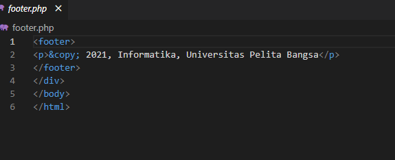
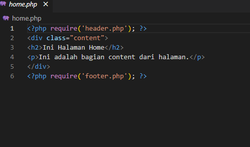
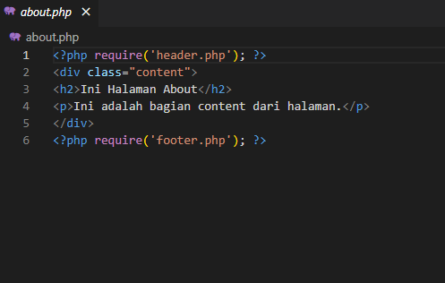
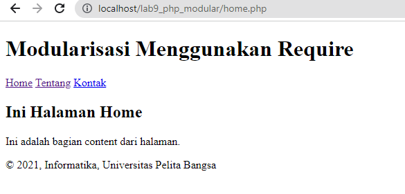
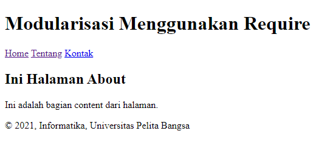

## Nama:Nahrul Wijaya
## Kelas:TI.20.A1
## Nim:312010415

Langkah langkah praktikum 8

1. Buat file baru dengan nama header.php

2. Buat file baru dengan nama footer.php

3. Buat file baru dengan nama home.php

4. Buat file baru dengan nama about.php

5. Keluaran

